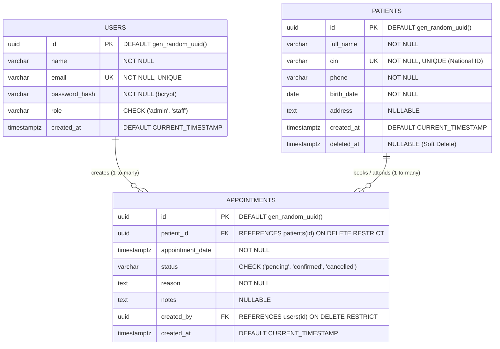

# ClinicFlow — Database Design & Entity Relationship Document (ERD)

## 1. Overview
This document satisfies **Deliverable 1.1 (Conception Base de Données)** for the ClinicFlow management application.

ClinicFlow is built on **PostgreSQL 16** with strong relational integrity, UUID primary keys, and performance indexes tailored to high-frequency medical searches and appointment conflict checks.

---

## 2. Entity-Relationship Diagram (ERD)

---

## 3. Relationship Justification

### 1-to-Many (`1:N`): Users → Appointments
* **Semantics**: One clinic staff member or administrator creates/schedules multiple appointments (`created_by`).
* **Cardinality**: `users (1) ───< appointments (N)`
* **Foreign Key**: `appointments.created_by → users.id`
* **Integrity**: `ON DELETE RESTRICT` guarantees that an audit log of who scheduled an appointment is never silently destroyed if a user account is removed.

### 1-to-Many (`1:N`): Patients → Appointments
* **Semantics**: One patient maintains an ongoing, chronological history of clinic visits. Each appointment record belongs to exactly one patient.
* **Cardinality**: `patients (1) ───< appointments (N)`
* **Foreign Key**: `appointments.patient_id → patients.id`
* **Integrity**: `ON DELETE RESTRICT` ensures that clinical records cannot be orphaned. Deleting a patient is handled via soft-delete (`deleted_at`), preserving historical consultation records for compliance.

### Many-to-Many (`M:N`) Association: Patients ↔ Users
* **Semantics**: Over time, multiple staff members interact with multiple patients. 
* **Implementation**: The `appointments` table serves as the relational bridge containing rich interaction data (`appointment_date`, `status`, `reason`, `notes`).

---

## 4. Constraints & Data Integrity

1. **UUID Primary Keys**:
   - Generated natively via PostgreSQL `gen_random_uuid()`. Prevents ID enumeration attacks and enables distributed ID generation.
2. **National ID Uniqueness (`cin UNIQUE`)**:
   - Strict `UNIQUE` constraint on `patients.cin` to prevent accidental duplicate patient dossiers.
3. **Domain Integrity via `CHECK` Constraints**:
   - `users.role` restricted to `admin` or `staff`.
   - `appointments.status` restricted to `pending`, `confirmed`, or `cancelled`.
4. **Soft Deletion (`deleted_at`)**:
   - Included in `patients` table to safely retire patient profiles while maintaining foreign key integrity with historical appointments.

---

## 5. Performance Indexes

| Index Name | Table & Columns | Purpose |
| :--- | :--- | :--- |
| `idx_patients_cin` | `patients(cin)` | O(1) lookups for CIN uniqueness validation and fast search. |
| `idx_patients_full_name` | `patients(full_name)` | Accelerates patient search by name. |
| `idx_patients_deleted_at` | `patients(deleted_at)` | Fast exclusion of soft-deleted records during paginated queries. |
| `idx_appointments_date` | `appointments(appointment_date)` | Accelerates dashboard metrics (`todayAppointments`) and date filtering. |
| `idx_appointments_status` | `appointments(status)` | Accelerates dashboard KPI aggregations (`pending`, `confirmed`). |
| `idx_appointments_patient_id` | `appointments(patient_id)` | Fast lookup of appointment history for a given patient. |
| `idx_appointments_patient_date_status` | `appointments(patient_id, appointment_date, status)` | Critical composite index optimizing the **30-minute conflict detection** rule. |
